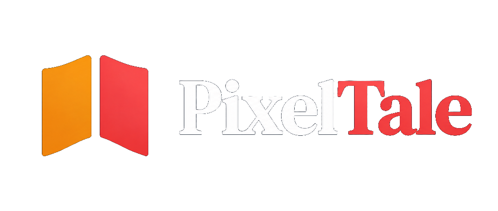
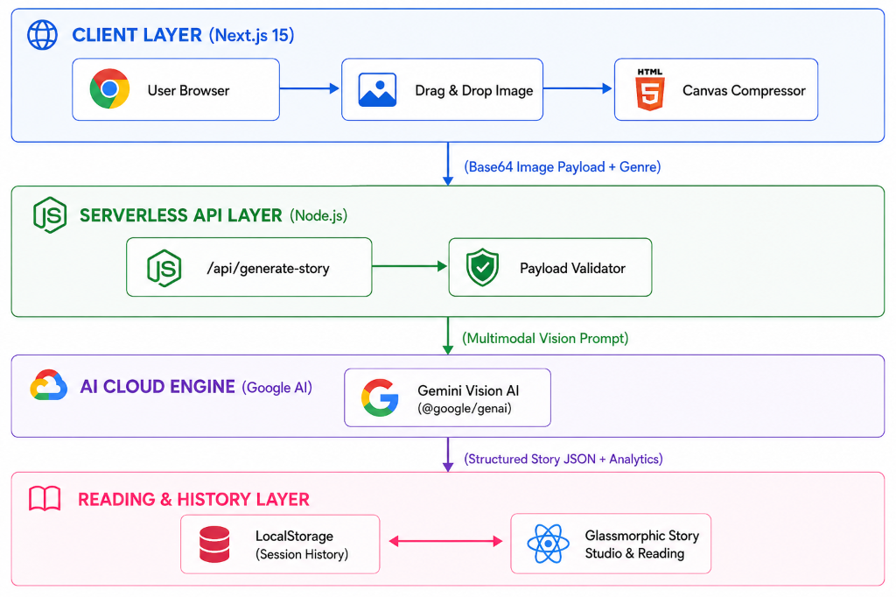

<div align="center">
  

  ### Transform Your Images Into Immersive AI-Powered Stories. Synthesized by AI in Seconds.

  Visual image-to-story generation, multimodal AI analysis, glassmorphic web dashboard, and interactive reading studio.

  **[Live App](https://github.com/musama0065/pixeltale)** · Next.js 15 + React 19 + TypeScript · Deployed on Vercel
</div>

---

## 🌟 What it Does

**PixelTale** is your intelligent visual storytelling assistant. It automatically analyzes uploaded photos, digital art, or illustrations, extracts visual context (objects, mood, lighting, characters, and scene dynamics), and transforms raw images into clean, immersive, and digestible narrative briefings.

- 🎨 **Multimodal Vision Analysis** — Analyzes uploaded images to detect fine details, emotions, and atmosphere using Gemini Vision models.
- 🎭 **6+ Curated Story Styles** — Whimsical, Sci-Fi, Mystery, Cyberpunk, Fantasy, and Film Noir.
- ⏱️ **Dynamic Reading Analytics** — Crisp story breakdown with estimated reading time, word count, and narrative complexity.
- 🖼️ **Smart Client-Side Canvas Compression** — Pre-compresses large image files on the client before dispatching to prevent payload timeouts.
- 💾 **Local Session History** — Automatically saves, organizes, and lets you revisit past stories directly in your browser.
- 🌓 **Glassmorphic Interactive Dashboard** — Smooth Framer Motion animations, theme controls, genre selector, confetti delighters, and markdown export.
- ⚡ **High-Performance Caching** — Intelligent in-memory caching for API responses to ensure sub-second response times for repeat visits.

---

## 🏗️ Architecture



---

## 🛠️ Tech Stack

| Layer | Tech |
| :--- | :--- |
| **Frontend UI** | Next.js 15 (App Router), React 19, TypeScript, Lucide React, Framer Motion, Custom Glassmorphic CSS Engine |
| **Backend API** | Next.js Serverless API (`/api/generate-story`), Node.js 20+ |
| **AI Synthesis** | Google GenAI SDK (`@google/genai`), Gemini 2.5 Flash / Gemini 3.6 Flash |
| **File Handling** | `react-dropzone` with client-side HTML5 Canvas compressor |
| **Deployment** | Vercel (Web Application) |

---

## ⚡ Engineering Problems Solved

| Problem | Root Cause | Fix |
| :--- | :--- | :--- |
| **Vercel Body Payload Limit (413)** | Uploading high-res raw camera images (10MB+) exceeded Vercel serverless request body size limits. | Implemented client-side HTML5 Canvas compression before API request, scaling images down to optimal dimensions under 1MB. |
| **Hanging API Requests** | Unresponsive AI model socket connections held network threads open. | Configured strict `maxDuration = 60` export in Next.js route handlers with explicit timeout signals. |
| **Missing Image Thumbnails / Preview Fills** | Dynamic canvas rendering sometimes broke aspect ratios on custom uploads. | Built an aspect-ratio aware image util with object-fit container fallbacks. |
| **Gemini Output JSON Formatting Errors** | AI model occasionally returned raw text or unformatted markdown code fences around JSON outputs. | Enforced strict persona prompts specifying JSON schema coupled with regex extraction fallback before parsing. |
| **Stale / Duplicate Session History** | Multiple uploads of identical images overwrote previous session outputs. | Implemented unique hash-based UUID keying per generated story session in LocalStorage. |

---

## 🚀 Run It Locally

### Prerequisites
- **Node.js**: v20 or higher
- **Google Gemini API Key**: Get one for free from [Google AI Studio](https://aistudio.google.com/)

---

### 1. Web Application (`frontend`)

```bash
# Clone the repository
git clone https://github.com/musama0065/pixeltale.git
cd "AI story teller/frontend"

# Install Node dependencies
npm install

# Create environment file
# Add your GEMINI_API_KEY to frontend/.env.local

# Start development server
npm run dev
```

Open [http://localhost:3000](http://localhost:3000) in your browser to view the interactive web dashboard.

---

## ⚙️ Environment Variables

### Web App (`frontend/.env.local`)

| Variable | Required | Description |
| :--- | :---: | :--- |
| `GEMINI_API_KEY` | **Yes** | Your Google Gemini AI Studio API key. |

---

## 📡 API Overview

| Method & Endpoint | Parameters | Purpose |
| :--- | :--- | :--- |
| `POST /api/generate-story` | `{ image, mimeType, genre }` | Accepts base64 image and genre, returns AI-synthesized narrative story JSON. |

---

## 🌐 Deployment Notes

- **Vercel (Web Dashboard)**: Connect your GitHub repository to Vercel. Set Root Directory to `frontend` and add `GEMINI_API_KEY` under Environment Variables.

---

## 🗺️ Roadmap

- [ ] 🎙️ **Voice / Audio Story (Text-to-Speech)** — Generate 3-minute morning audio podcasts using Google TTS or ElevenLabs.
- [ ] 📖 **Illustrated PDF Export** — Export generated stories into printable multi-page digital storybooks.
- [ ] 💬 **WhatsApp & Telegram Story Bots** — Push instant visual stories directly to messaging apps.
- [ ] 🎯 **Personalized Scene Editor** — Customize story prompts, character details, and muted themes.

---

<div align="center">
  Built by <b>Muhammad Usama</b>
</div>
